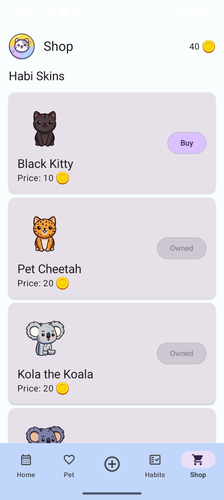

# App Concept

**HabiPet** is a habit-building app that allows users to set and track personal habits by defining goals for daily and weekly completion. Consistently completing habits rewards users with in-app coins, which they can spend in the shop to purchase animated pets, unique skins, and customizable backgrounds.

These features aim to motivate users through positive reinforcement, gamification, and interactive rewards - making habit-building an engaging experience.

### Goals & Features

- **Habit creation and tracking** (CRUD functionality)
- **Virtual pet interaction and progression** (XP, level, and customization)
- **Calendar and tracking of habit completion**
- **Shop for customization and rewards** (Pet skins and habitats)

### Download APK on WeTransfer: [CLICK HERE](https://we.tl/t-FARAu7TTef)

---

    

## Table of Contents

- [App Structure](#app-structure)
    - [Screenshots](#screenshots)
    - [Animation Showcase](#animation-showcase)
- [Usability Test Plan](#usability-test-plan)
    - [Heuristic Evaluation](#heuristic-evaluation)
- [Usability Test Results](#usability-test-results)
- [Conclusion](#conclusion)

---

# App Structure

## Data

1. **Habits Table**: Stores habit details (name, description, repetition, streak, icon, color, etc.).
   - Habits have a one-to-many relationship with `PetStats` (completion rewards XP).
   - Habits link to `PetStats.coins` since you earn coins by reaching a habit’s streak goal.
   
2. **PetStats Table**: Stores data related to the pet (name, level, XP, skin, habitat, coins, etc.).

### Data Flow

1. **HabiPetDatabase**: Creates the Room database for the entire project (saving `Habit` and `PetStats`).
2. **Habit & PetStats Entity and DAO**: Controls how data (habit- or pet-related) is saved to the Room database.
3. **Habit & PetStats ViewModel**: All data-related operations are executed within the `viewModelScope`. The ViewModel acts as an intermediary between the UI and data layer for both habits and petStats.
4. **Habit & PetStats Repository**: Provides a clean and organized way to manage habit or pet data and its interactions with other parts of the application.
   - Handles the actual CRUD logic for `Habit` (e.g., `addHabit`, `completeHabit`) and `PetStats` (e.g., `updateXP`, `buyShopItem`).
   

## UI

### Views

- **HomeScreen**: Displays a list of recent habits, a habit calendar, and the `CompleteHabitCard`, where habits can be marked as completed.
  
- **PetScreen**: Shows detailed pet stats, animations, and interactions (e.g., tap animation)
  - Clicking “Customize” navigates to `CustomizePetScreen`, where you can set `PetStats.skin` and `PetStats.habitat`.
   
- **AddHabitScreen**: Allows users to input new habits and choose repetition, icon, and color
  
- **HabitsScreen**: Provides an overview of all habits stored in the database
  
- **HabitDetailsView**: Displays a detailed overview of a selected habit (includes an edit button)
  - **EditHabitView**: Enables users to edit or delete the habit
    
- **ShopScreen**: Features purchasable skin and habitat items for the PetScreen
  - Purchased items are added to `PetStats.ownedSkins` or `PetStats.ownedHabitats` to save them for later use in `CustomizePetScreen`.

### Components

- **TopHeaderBar**: Contains the logo, heading, and a display for `PetStats.coins`
  
- **BottomNavBar**: Contains the main navigation routes (Home, Pet, Add Habit, Habits, and Shop)
  
- **RepetitionSelector & IconAndColorSelector**: Used in `AddHabitScreen` and `EditHabitView` to select a predefined habit repetition, icon, and color.
  - If `habit.repetition` is set to "Test", the cooldown for completing a habit is only one minute - that is to efficiently test the habit completion and receive rewards (`petStats.coins`) during a usability test.

- **HabitListItem**: Used for displaying habits in lists (HomeScreen or HabitsScreen). Clicking it navigates to the habit’s details page.
  
- **HabitCompleteCard**: Enables users to mark a habit as completed based on its repetition
  
- **ShopItemCard**: Displays a single shop item with a preview of a skin or habitat in the ShopScreen
  
- **PetLevelBar**: Linear progress bar used in the PetScreen to display the pet’s current XP and level

### Util

Utility objects provide calculations and reusable functionalities across the app.

- **HabitUtil**: Contains helper functions for managing habit-related data, such as color, streak goals, rewards, and time progress calculations.
- **ImageUtil**: Maps string identifiers (e.g., habit icons, pet skins, and habitats) to their corresponding drawable resources.
- **GifUtil**: Similar to `ImageUtil`, it provides access to GIF and image resources for animations on the PetScreen.

### Screenshots

  
  
  

  
  

---

## Animation Showcase

**4 different Habis** with three randomly aligned **idle** animations. When **tapped** on the PetScreen, you can see their tapped animation.
The animations are the same for any purchasable skin for the pets.

### Kitty & Kola

    
    

### Wha-Lee & Puffy

    
    

---

# Usability Test Plan

## Purpose and Research Questions

The primary goal of the user test is to evaluate the usability, intuitiveness, and enjoyment of our habit-building app. Specifically, we try to answer the following key questions:

- How intuitive is it for users to create, complete, and manage habits in the app?
- Are the shop and pet interaction features engaging and easy to use?
- What areas of the app, if any, confuse or frustrate users?

Our app is designed for a wide audience since habits are universal and relevant for all age groups. However, the app's cute aesthetic may particularly appeal to younger users and potentially skew toward female users. We plan to recruit at least five participants for our user test.

## Data to Collect

To evaluate the app effectively, we will collect the following data:

- **Task Completion Time:** Measure the time it takes for users to complete each task, providing an objective measure of efficiency.
- **Task Completion Success:** Record whether participants can complete tasks without assistance (success or failure).
- **Perceived Ease of Use:** Use the Single Ease Question (SEQ) after each task to understand the perceived difficulty on a scale of 1 (Very Difficult) to 7 (Very Easy).
- **Overall Usability and Satisfaction:** Answer the System Usability Scale (SUS) after all tasks to gather insights into overall user satisfaction.
- **Qualitative Feedback:** Gather some qualitative feedback through open-ended questions to explore user experiences and suggestions.

#### Potential Qualitative Questions

- What did you enjoy most about the app?
- Was anything in the app frustrating or confusing?
- What feature or improvement would you suggest to make the app better?

### Methods to Use

Participants will complete a series of tasks designed to evaluate core app functionality:

1. Create a Habit
2. Complete a Habit (You don’t have to actually do the task in real life)
3. Buy something from the shop
4. Interact with one of your pets

Each task will be clearly outlined in a task list provided to participants. As previously stated, we will use the SEQ after each task individually and also the SUS after all tasks are completed.

#### Recording and Observation

We will use screen-recording software to capture user interactions, focusing on navigation paths, errors, and behavior.

#### Post-Test Interview

After completing the tasks, we will conduct a brief interview to ask qualitative questions and clarify observations made during testing. This will provide additional insights into the user experience and areas for improvement.

## Data Visualization

To present the collected data effectively, we will use the following methods:

- **Task Completion Time:** Represented as a bar chart showing the average time taken for each task across all users.
- **Task Completion Success:** Displayed using a stacked bar chart to illustrate the number of users who successfully completed each task versus those who did not.
- **SEQ Results:** Shown as either a line chart or a bar chart to visualize the average SEQ score for each task.
- **SUS Score:** Depicted using a box plot to show the distribution of SUS scores among participants or as a single bar representing the average SUS score.
- **Qualitative Feedback:** Summarized in a word cloud to highlight recurring themes or presented in a table to categorize user suggestions and issues.

---

## Heuristic Evaluation

We analyzed the current version (20.01.2025) of our Mobile Application to find potential problems which we can work on in the coming week as well as analyze from the feedback we will gather in our upcoming user test.

### 10 Usability Heuristics

1. Visibility of System Status
2. Match Between System and the Real World
3. User Control and Freedom
4. Consistency and Standards
5. Error Prevention
6. Recognition Rather Than Recall
7. Flexibility and Efficiency of Use
8. Aesthetic and Minimalist Design
9. Help Users Recognize, Diagnose, and Recover from Errors
10. Help and Documentation

### Issues Table

| Issue | Description                                                                                                                                                                          | Heuristic                                                  | Severity |
|-------|--------------------------------------------------------------------------------------------------------------------------------------------------------------------------------------|------------------------------------------------------------|----------|
| 1     | The shop does not display all categories of items on first sight, you have to scroll down to see that there are different buying options than just pets.                             | 6. Recognition Rather Than Recall                          | 3        |
| 2     | In the Shop right now, you have to scroll all the way down to the section "Habitats" without a faster way to see only habitats, like for example filtering for only Backgrounds.     | 7. Flexibility and Efficiency of Use                       | 5        |
| 3     | In the "Customize" window when you have a lot of different skins it would maybe be easier to filter for something you want to add instead of scrolling through.                      | 7. Flexibility and Efficiency of Use                       | 4        |
| 4     | On the calendar page right now, there is not really a way to switch to different months than the one you are currently in. Even though you maybe want to view your old achievements. | 3. User Control and Freedom                                | 7        |
| 5     | In the current version the "Icon" input field in the "Add New Habit" page seems a bit confusing because a user would not know what to input here by default.                         | 9. Help Users Recognize, Diagnose, and Recover from Errors | 7        |
| 6     | There is no description about what the app is used for which could potentially confuse people who download the app out of curiosity without having ever used a habit app.            | 10. Help and Documentation                                 | 5        |

---

# Usability Test Results

### Participants
Five participants completed the usability test after providing consent about their answers being used in our university study.

---

## Task Completion Time
Most tasks showed similar completion times across all participants, suggesting that the tasks were clearly understood and primarily required execution rather than involving any significant struggle with the interface.

However, task 1 had one notable outlier with User 2, who took significantly longer due to a bug. The “test” selection box was not displayed correctly, and its label was missing, leaving the participant unsure of what to choose and needing assistance. This underscores the need to address UI issues to ensure task clarity and usability. We gave this user a time for task 1, but in actuality, this was only possible because we had to help the user with completing the task. Theoretically, the task success for User 2 for task 1 should be marked as “not completed.”

We also included a visualization of the task completion times with a box plot to better illustrate the potential outliers and the comparison in speed for each task.

 

---

## SEQ Results
The SEQ results indicate that tasks 3 (Buy from the Shop) and 4 (Interact with Pets) were the most polished, with all participants giving the highest rating of 7. However, Task 2 (Complete a Habit) had the lowest average SEQ score of 4.8, largely due to its unrefined design. The waiting time before completing the habit was unclear, as the countdown displayed "0 hours and 0 minutes" instead of showing the actual remaining time of 10 seconds in the test setting because we did not include “seconds” in our timer. Additionally, participants had to switch views for the button to refresh, which caused confusion if it hadn’t been explained beforehand.

Task 1 (Create a Habit) had the second lowest average SEQ score of 5.4, primarily due to a bug experienced by User 2. The "test" selection box was not displayed correctly, and the text inside the box was missing, making the task impossible to complete without assistance.

---

## System Usability Scale (SUS)
The SUS scores for each user are as follows:
- User 1: 55.0
- User 2: 82.5
- User 3: 75.0
- User 4: 80.0
- User 5: 92.5

The overall average SUS score for the app is **77.0**.  
A SUS score of 77.0 is considered "good" according to industry benchmarks.

Most users had similar experiences, though some enjoyed the app more than others. For instance, User 5 had a significantly more positive experience compared to User 1, who provided more critical feedback. Users rated most aspects of the app positively, with strong scores for usability and ease of learning. However, the score for reusability ("I think that I would like to use this system frequently.") was relatively low. This is likely due to the app being developed within a short two-week timeframe, meaning it lacked the polish necessary to be completely satisfying. Also, the low score in reusability could be attributed to the test participants not being accustomed to the general idea of using a habit tracker app in their everyday life.

---

## Summary of Key Findings
- **Strengths:** Users appreciated the playful and clean design, especially the pet animations and habit customization features.
- **Weaknesses:** Visual bugs, lack of feedback for task completion, and limited calendar functionality.

### Possible Future Improvements
- **GIF Animation Loading:** The current .apk is very large due to all the GIFs being saved and loaded from the `/res/drawable` folder. Polishing the animation logic was simply not on our scope for this project.
- **Habit Completion:** The `HabitCompleteCard` does not show its content dynamically yet, the user has to refresh the Home page to see the currently active completion status.
- **HomeScreen Calendar:** Adding the feature to click on days to see which habits have been completed on that particular day of the month. Additionally, let the user be able to switch between months.
- **General Design:** Especially the `HabitDetailsView` could be improved design-wise, but for a time limit of two weeks, it was more crucial to focus on the main "selling points" (MVP) of our app than on the detail design.

---

# Conclusion

The usability test revealed both positive and negative aspects of our app. We are proud of what we achieved within the limited time frame and appreciate the valuable feedback from participants. While time constraints prevented additional updates, this feedback will be instrumental for future projects. Overall, we are satisfied with the app as it stands.

---

## Final Reflection

### Klausi
From the start, we had a pretty clear structure about what each team member would contribute to this project. First, we started to find an idea that would be fun for both team members and then we worked on a fitting mockup and initial presentation together. After we figured out what our main idea would revolve around—combining an Android app with interesting visuals—we decided that Mirjam would mainly focus on the coding process while I would prepare anything visual, as well as conducting the user study.

In the end, I created multiple pets for our application, made them each 2 additional skins, made rigs for their animations (skills I learned in this semester’s 2DGA course), and made 4 animations for each pet. I also did the icon design and drew the backgrounds by hand, which could be purchased in the app. After that, I also helped a bit with implementing a smooth transition of the animations in the app itself, and I also conducted the user test interviews as well as the analysis of the user test and possible improvements that could be made to the app.

We are both happy with the outcome of the app because it definitely met the initial concept we envisioned, and we both learned a lot for the skills we value the most. There are a lot of things that could have still been improved; there was a lot of good feedback we got from our user tests, but sadly, the time of two weeks does not make it possible for us to make the perfect app. Still, as mentioned, we are very happy with our result and the learning experience.

### Mimi
Looking back at the project, I am very happy with our decision to split the work so that I could fully focus on the coding while Klausi handled the animations, usability tests and design. Timewise, this setup was perfect, allowing us to complete the project within two weeks while implementing all essential features.

One of my biggest challenges I faced was implementing smooth animations. The current solution (using multiple GIFs from the `/res/drawable` folder) is far from optimal in my opinion. It significantly increased the APK size and increases the screen loading time, which isn't ideal for a scalable app. However, given the time of only two weeks and the complexity of alternative solutions, I accepted this trade-off. Diving deeper into a better animation solution would have gone beyond the project’s intended scope, so for this case I am totally fine with how we handled it.

On the coding side, I learned a tremendous amount about building Kotlin apps, implementing CRUD operations, and working with a Room database. The Creative Code Lab (CCL) played a huge role in solidifying my understanding, and I now feel confident that I could build a similar project again in the future.

I also take pride in the fact that I implemented all MVP features, plus several extra features that were on our "maybe-list." Despite the challenges, the project turned out exactly how we envisioned, and I’m very happy with the result.